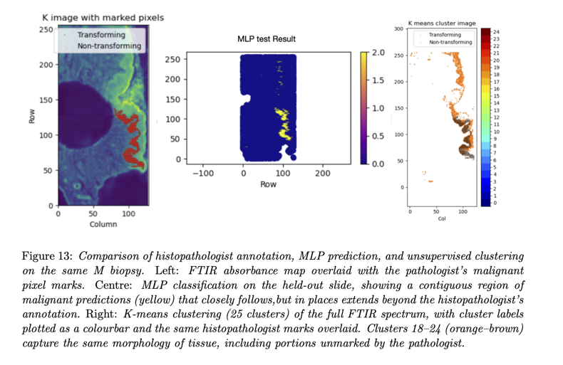

# FTIR Spectroscopy + Machine Learning for Oral Lesion Classification

This repository contains the main code pipeline and supporting thesis for my MPhys project investigating whether Fourier Transform Infrared (FTIR) spectroscopy combined with machine learning methods can help distinguish benign and malignant oral epithelial lesions.

The project focuses on whether the functional IR band (2200–4000 cm⁻¹), which can be measured on standard **glass slides**, can provide clinically useful classification performance compared with the traditional fingerprint band (1000–1800 cm⁻¹) measured on CaF2 substrates. 

## Description of the Project:

This project explores a way to help clinical professionals treat
oral cancers more accurately, and hopefully with fewer painful repeat biopsies, by using imaging
techniques and artificial intelligence. Currently, tissue samples are examined under a microscope by
a histopathologist (someone who studies changes in tissues caused by disease), but studies show they
can only predict which early lesions will turn cancerous (since they with either remain benign or
become cancerous) about 25–40% of the time. When imaged using infrared techniques, very small
differences in the spectra can reveal the chemistry inside each cell. Many of these spectra are fed
into a simple neural network “brain” (called a multi-layer perceptron) that learns to tell benign from
malignant tissue. Even without access to the region of the spectrum which calcium fluoride allows
us to see (calcium fluoride is not currently used in clinical practice but it allows us to see a region
of the spectrum called the fingerprint band, which provides the artificial intelligence with much
more information), the method on glass slides already used in the clinic (where we can no longer
access the information-rich fingerprint region) achieves ∼99% accuracy at spotting healthy tissue
and 77% accuracy at identifying cancerous changes. In tests on biopsies unseen to the algorithm, it
can also highlight potentially cancerous regions the pathologist missed. These results suggest that
combining infrared imaging techniques with machine learning could give patients clearer answers
faster and significantly improve their outcomes and experience.

## What this repository includes

- `MLP-Classifier.ipynb`  
  Main notebook implementing the preprocessing, feature construction, masking, training, and evaluation pipeline for FTIR biopsy data using a scikit-learn MLPClassifier.

- `Translating Cancer Research to the Clinic.pdf`  
  Full thesis describing the physics background, preprocessing choices, model design, experimental setup, results, and discussion. 

## Method overview

The workflow used in this project is:

1. Load FTIR hyperspectral biopsy data and metadata
2. Build tissue and lesion masks
3. Extract spectral features from selected wavenumbers
4. Apply spectral normalisation and standard scaling
5. Train a multi-layer perceptron (MLP) on pixel-level spectra
6. Evaluate performance on unseen biopsy data using sensitivity and specificity.

The thesis compares several normalisation methods, including:
- global product normalisation
- local ratio normalisation
- local difference normalisation

The main architecture is a **scikit-learn MLPClassifier** with:
- 4 hidden layers
- 60 nodes per layer
- ReLU activations
- SGD optimisation
- L2 regularisation
- batch-based training on pixel spectra

## Key results

Using unseen biopsy data, the project found:

- **Fingerprint band:** 99% specificity and 89% sensitivity
- **Functional band:** 99% specificity and 77% sensitivity 

This showed that although the fingerprint band performs better, the functional band on standard glass slides still retains diagnostic value, with only a modest drop in sensitivity.  

The work also found that the model could, in some cases, highlight malignant regions beyond those manually marked by the histopathologist, with supporting evidence from k-means clustering. 

## Why this matters

A major barrier to FTIR adoption in pathology is the need for CaF2 slides, whereas standard histopathology workflows already use glass slides. Demonstrating useful classification performance on glass could make FTIR-based diagnostics more practical for real clinical settings. 

## Thesis

The accompanying thesis is included here as the main scientific reference for the project.

